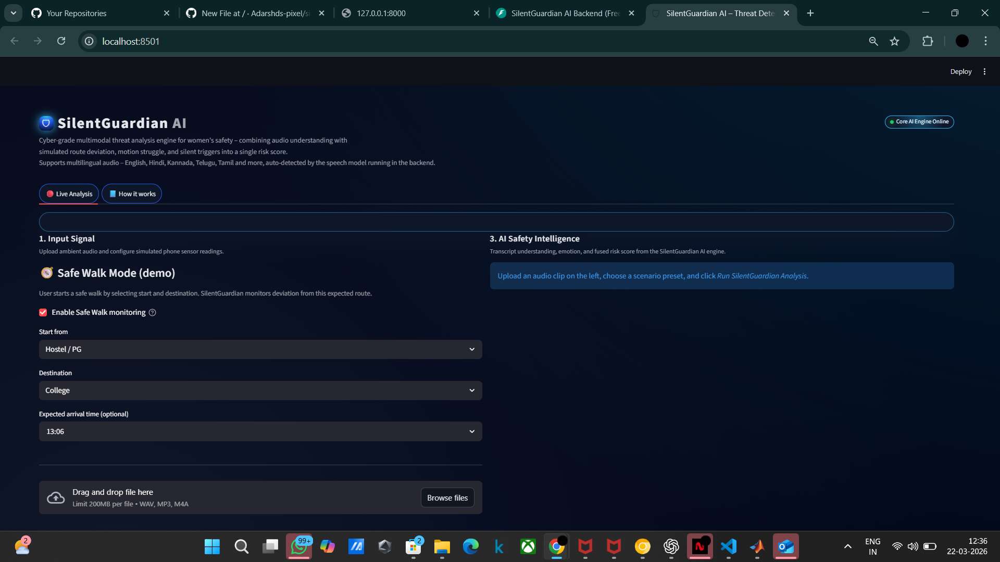
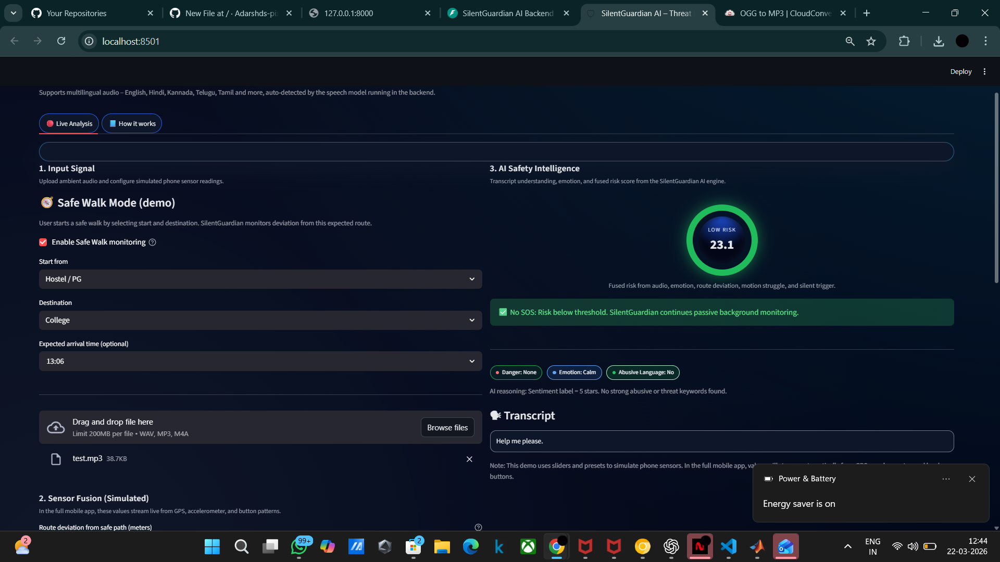
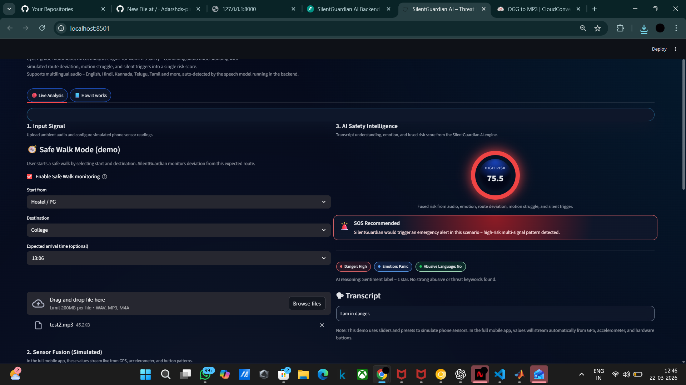
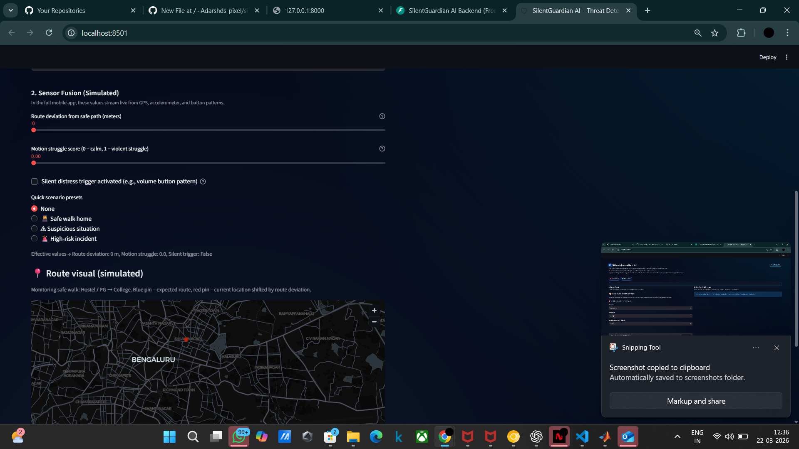
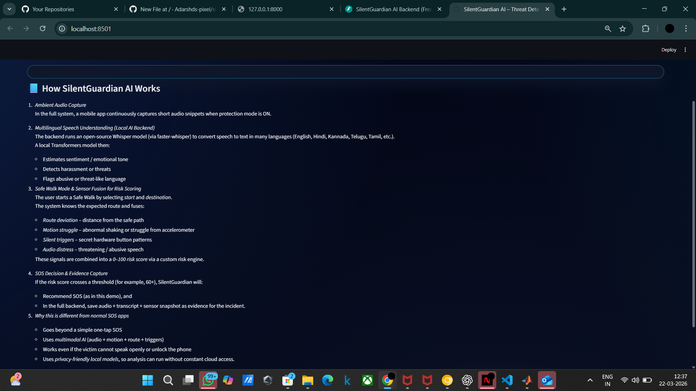

🚨 SilentGuardian AI – Multimodal Women Safety System

🛡️ An AI-powered real-time safety system that detects threats using audio intelligence, NLP, and contextual signals, and triggers emergency alerts when danger is detected.

🌟 Overview

SilentGuardian AI is a cyber-grade multimodal threat analysis system designed to enhance women's safety.

It continuously analyzes:

🎤 Audio input (speech/emotion)
🧠 Natural language understanding
📍 Contextual signals (route deviation, motion struggle)
⚠️ Risk scoring engine

👉 Based on these inputs, the system determines whether to:

✅ Continue monitoring
🚨 Trigger SOS alerts

🧠 Key Features
🎤 Speech-to-Text (Multilingual) using Whisper
🤖 NLP-based Threat Detection (emotion + intent analysis)
⚠️ Dynamic Risk Scoring Engine (0–100 scale)
🚨 Automatic SOS Trigger System
🗺️ Safe Walk Mode (Route Monitoring Simulation)
📊 Sensor Fusion (motion + deviation + distress triggers)
🧾 Incident Logging & Evidence Storage
🎨 Interactive UI Dashboard (Streamlit)

🏗️ System Architecture
User Audio Input
        ↓
Speech-to-Text (Whisper)
        ↓
NLP Classification (Emotion + Threat Detection)
        ↓
Sensor Fusion (Route + Motion + Triggers)
        ↓
Risk Engine (Score 0–100)
        ↓
Decision System
   ↓           ↓
Low Risk    High Risk
   ↓           ↓
Monitor     🚨 SOS Trigger

⚙️ Tech Stack
🧠 AI / ML
Python
OpenAI Whisper (Speech Recognition)
Transformers / NLP Models
Scikit-learn (optional logic)

⚡ Backend
FastAPI

🎨 Frontend
Streamlit

📊 Data Handling
NumPy
Pandas

📸 Demo Results

🟢 Low Risk Scenario
Input: “Help me please”
Risk Score: 23.1
Output: ✅ No SOS Triggered

🔴 High Risk Scenario
Input: “I am in danger”
Risk Score: 75.5
Output: 🚨 SOS Triggered

🧪 How It Works
1. 🎤 Audio Processing
User uploads audio input
Converted to text using Whisper
2. 🤖 NLP Analysis
Detects:
Emotion (calm / panic)
Threat intent
Abusive language
3. ⚠️ Risk Engine

Risk is calculated using:

Risk Score =
  (Threat Level)
+ (Emotion Intensity)
+ (Route Deviation)
+ (Motion Struggle)
+ (Silent Trigger)
  
4. 🚨 Decision Logic
IF Risk Score > Threshold:
    Trigger SOS
ELSE:
    Continue Monitoring
   
🗺️ Safe Walk Mode (Simulation)
User sets:
Start location
Destination
System tracks:
Route deviation
Movement irregularities
Adds contextual risk signals

📸 Demo Screenshots
🧠 System Dashboard

🟢 Low Risk Scenario
Input: "Help me please"
Output: Low Risk (No SOS Triggered)

🔴 High Risk Scenario
Input: "I am in danger"
Output: High Risk (SOS Recommended 🚨)

⚙️ Prediction Interface

📖 How It Works Section

## 🔍 Risk Comparison

📂 Project Structure
silentguardian-ai/
│
├── backend/
│   ├── app.py
│   ├── audio_processor.py
│   ├── gpt_classifier.py
│   ├── risk_engine.py
│   ├── evidence_store.py
│   ├── models.py
│   └── requirements.txt
│
├── frontend/
│   ├── streamlit_app.py
│   ├── utils.py
│   ├── styles.py
│   └── requirements.txt
│
├── logs/
├── evidence/
└── README.md

🚀 Installation & Setup
1. Clone Repository
git clone https://github.com/Adarshds-pixel/silentguardian-ai.git
cd silentguardian-ai
2. Setup Backend
cd backend
pip install -r requirements.txt
python -m uvicorn backend.app:app --reload

4. Setup Frontend
cd frontend
pip install -r requirements.txt
python -m streamlit run streamlit_app.py

6. Open in Browser
Frontend → http://localhost:8501
Backend  → http://127.0.0.1:8000
📊 Output Example
Risk Level: HIGH 🚨
Score: 75.5
Emotion: Panic
Decision: SOS Triggered

🔒 Safety & Privacy
Local processing supported (no mandatory cloud dependency)
Audio data used only for analysis
Logs stored securely for evidence tracking

⚠️ Limitations
Uses simulated sensor data (not real device sensors)
Accuracy depends on audio clarity
NLP model may require fine-tuning for edge cases
🚀 Future Improvements
📱 Mobile App Integration
📍 Real GPS Tracking
🔊 Real-time microphone streaming
🧠 Advanced deep learning models (LSTM / Transformers)
📡 Live alert system (SMS / WhatsApp API)

💡 Use Cases
Women safety monitoring apps
Smart wearable integration
Emergency detection systems
Public safety analytics

👨‍💻 Author

Adarsh
AI/ML Developer | Building Real-World Intelligent Systems

⭐ Support

If you like this project:

👉 Star ⭐ the repo
👉 Share with others
👉 Use it in real-world applications
